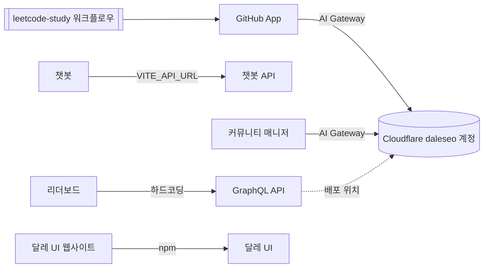

# 배포 지도

달레 스터디 서비스가 어디에 어떻게 배포되는지 정리한 문서입니다. 원본은 [`services.yaml`](./services.yaml)이고, 둘이 다르면 `services.yaml`을 기준으로 합니다.

마지막 확인: 2026-10-04

## 서비스

| 서비스 | 저장소 | 주소 | 호스팅 | 배포 |
| --- | --- | --- | --- | --- |
| 웹사이트 | [dalestudy.com](https://github.com/DaleStudy/dalestudy.com) | [dalestudy.com](https://dalestudy.com) | Cloudflare Workers | Workers Builds |
| 리트코드 스터디 | [homepage](https://github.com/DaleStudy/homepage) | [leetcode.dalestudy.com](https://leetcode.dalestudy.com) | GitHub Pages | 브랜치 배포 |
| 리더보드 | [leaderboard](https://github.com/DaleStudy/leaderboard) | [leaderboard.dalestudy.com](https://leaderboard.dalestudy.com) | GitHub Pages | Actions |
| 챗봇 | [chat](https://github.com/DaleStudy/chat) | [chat.dalestudy.com](https://chat.dalestudy.com) | GitHub Pages | Actions |
| 챗봇 API | [chat](https://github.com/DaleStudy/chat) | `dalestudy-chat-backend.fly.dev` | Fly | 수동 |
| 스케줄 | [schedule](https://github.com/DaleStudy/schedule) | [schedule.dalestudy.com](https://schedule.dalestudy.com) | Cloudflare Workers | Workers Builds |
| 커피챗 | [coffee](https://github.com/DaleStudy/coffee) | [coffee.dalestudy.com](https://coffee.dalestudy.com) | Cloudflare Workers | Workers Builds |
| 피드백 | [feedback](https://github.com/DaleStudy/feedback) | [feedback.dalestudy.com](https://feedback.dalestudy.com) | Cloudflare Workers | Workers Builds |
| GitHub App | [github](https://github.com/DaleStudy/github) | `github.dalestudy.com` | Cloudflare Workers | Workers Builds |
| 커뮤니티 매니저 | [community-manager](https://github.com/DaleStudy/community-manager) | `community-manager.dalestudy.workers.dev` | Cloudflare Workers | Actions |
| GraphQL API | [graphql](https://github.com/DaleStudy/graphql) | `graphql.daleseo.workers.dev` | Cloudflare Containers | Actions |
| 달레 UI 웹사이트 | [daleui.com](https://github.com/DaleStudy/daleui.com) | [www.daleui.com](https://www.daleui.com) | Cloudflare Workers | Actions |
| 달레 UI | [daleui](https://github.com/DaleStudy/daleui) | npm, Chromatic | npm, Chromatic | Actions |
| 에이전트 스킬 | [skills](https://github.com/DaleStudy/skills) | [skills.sh](https://www.skills.sh/dalestudy/skills) | skills.sh | - |

리더보드도 Chromatic에 Storybook을 배포합니다. 나머지 저장소(`.github`, `DaleStudy`, `leetcode-study`, `ai-study`, `english-interview`, `blog-study`, `coffee-chat`, `hackathon-blog`)는 배포하지 않습니다.

## 의존 관계

- 리더보드는 GraphQL API를 사용합니다. 주소가 `src/api/infra/gitHub/gitHubClient.ts`에 하드코딩되어 있습니다.
- 챗봇은 챗봇 API를 사용합니다. 주소는 Actions 변수 `VITE_API_URL`로 넣습니다.
- `leetcode-study`의 워크플로우가 GitHub App을 호출합니다.
- GitHub App과 커뮤니티 매니저는 `daleseo` 계정의 AI Gateway를 사용합니다.

## 계정

| 계정 | 서비스 | 소유자 |
| --- | --- | --- |
| Cloudflare `dalestudy` (`dalestudy.workers.dev`) | GraphQL API를 제외한 Cloudflare 서비스 | TODO |
| Cloudflare `daleseo` (`daleseo.workers.dev`) | GraphQL API, AI Gateway | TODO |
| Fly | 챗봇 API | TODO |
| GitHub Pages | 리트코드 스터디, 리더보드, 챗봇 | DaleStudy org |
